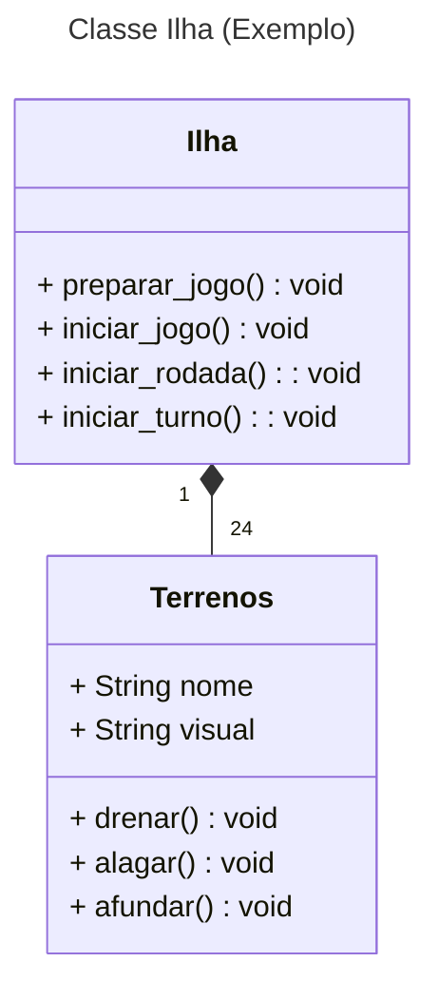

```mermaid
---
title: Classe Ilha (Exemplo)
---
classDiagram
    Ilha "1" *-- "24" Terrenos
    class Ilha{
        + preparar_jogo() void
        + iniciar_jogo() void
        + iniciar_rodada(): void
        + iniciar_turno(): void
    }
    
    class Terrenos{
        + String nome
        + String visual
        + drenar() void
        + alagar() void
        + afundar() void
    }

```